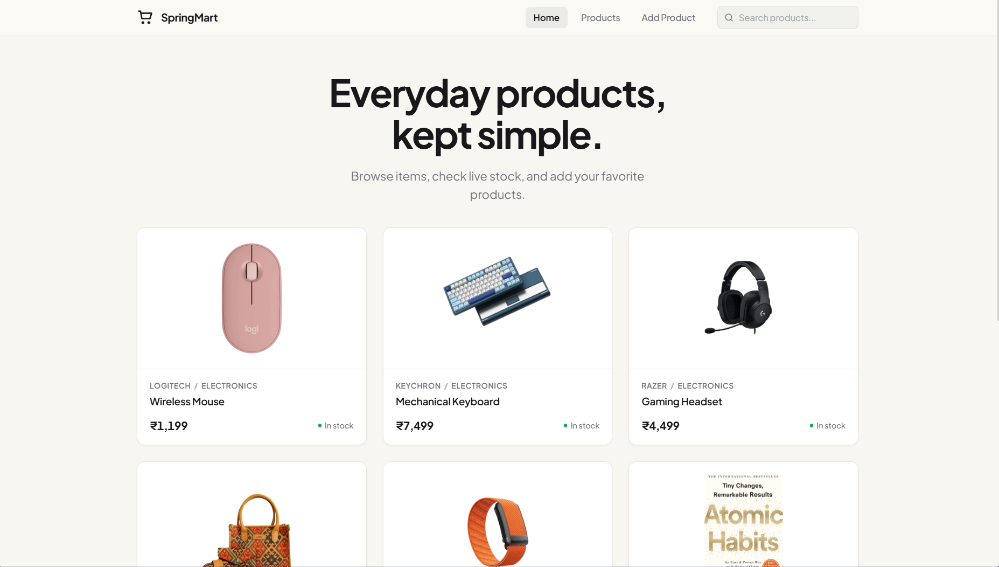
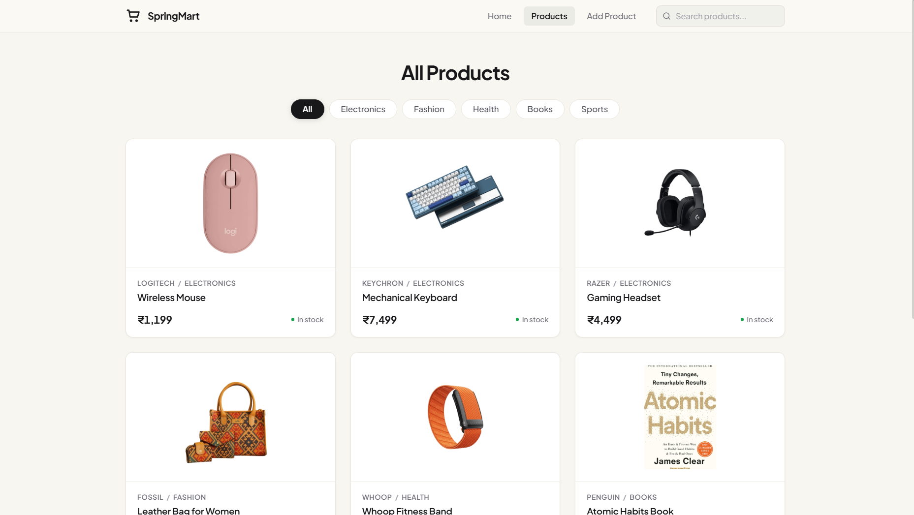
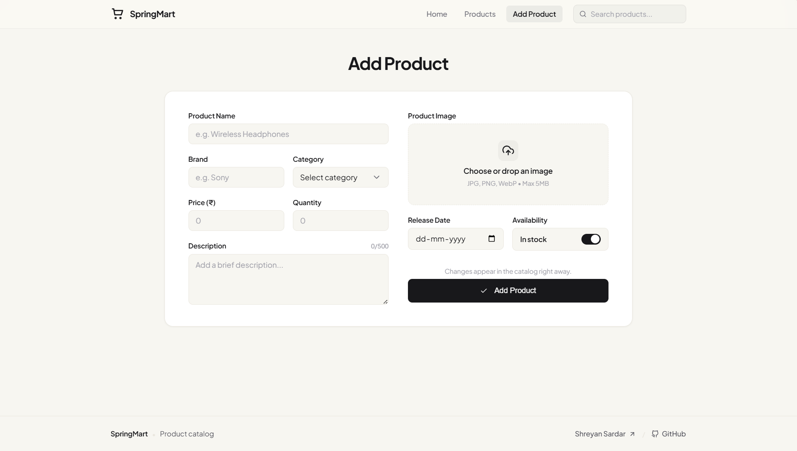

#  SpringMart

Full-stack product catalog built with Spring Boot and React. Features product management, multi-field search, pagination, and direct image streaming.

[](https://springmart.netlify.app/)
[](https://springmart-backend.onrender.com/api/)

---

## Preview

### Home


### Products


### Add Product


---

## Features

- **Product Management**: Add, edit, and delete items with validation and image preservation.
- **Multi-Field Search**: Fast search across name, description, category, and brand.
- **Image Streaming**: Raw image byte streaming directly from the database.
- **Pagination**: Server-side and client-side page navigation.
- **Auto-Seeding**: Loads sample products automatically on startup.

---

## Tech Stack

- **Backend**: Java 21, Spring Boot 3, Spring Data JPA, H2 Database, Maven
- **Frontend**: React 19, Sass, React Router
- **Deployment**: Docker, Netlify, Render

---

## Architecture

```text
HTTP Request ──> ProductController ──> ProductService ──> ProductRepository ──> H2 Database
```

- **Controller**: Handles HTTP endpoints, CORS, and multipart requests.
- **Service**: Handles business logic, updates, and image processing.
- **Repository**: Executes custom JPQL search queries.
- **Database**: H2 database storing product details and image bytes.

---

## API Reference

Base path: `/api`

| Method | Endpoint | Description | Request Format |
| :--- | :--- | :--- | :--- |
| `GET` | `/` | Health check | — |
| `GET` | `/products?page=0&size=10` | List products (paginated) | Query params (`page`, `size`) |
| `GET` | `/products/{id}` | Get product by ID | — |
| `GET` | `/products/search?keyword=...` | Search products | Query param (`keyword`) |
| `GET` | `/products/image/{id}` | Stream product image | — |
| `POST` | `/products` | Create product | Multipart (`product` + `imageFile`) |
| `PUT` | `/products/{id}` | Update product | Multipart (`product` + `imageFile`) |
| `DELETE`| `/products/{id}` | Delete product | — |

---

## Project Structure

```text
spring-mart/
├── springmart-backend/
│   ├── src/main/java/com/backend/springmart/
│   │   ├── config/             # CORS & app configuration
│   │   ├── controller/         # REST API endpoints
│   │   ├── dto/                # Request & response records
│   │   ├── model/              # JPA entities
│   │   ├── repository/         # Data repositories
│   │   └── service/            # Business logic & image handling
│   ├── src/main/resources/     # Application config & seed images
│   ├── Dockerfile              # Backend container build
│   └── pom.xml
├── springmart-frontend/
│   ├── src/
│   │   ├── components/         # Shared UI components
│   │   ├── features/           # Product pages and form logic
│   │   ├── styles/             # Sass design tokens & styles
│   │   └── App.jsx             # Client routes & shell
│   └── package.json
├── docker-compose.yml
└── README.md
```

---

## Getting Started

### Prerequisites
- Java 21+
- Node.js 20+
- Docker (optional)

### Backend
```bash
cd springmart-backend
./mvnw spring-boot:run   # Windows: .\mvnw.cmd spring-boot:run
```
API runs at `http://localhost:8080` (H2 Console: `/h2-console`).

### Frontend
```bash
cd springmart-frontend
npm install
npm start
```
App runs at `http://localhost:3000`.

### Docker
```bash
docker compose up --build
```

---

## Deployment

- **Frontend**: [springmart.netlify.app](https://springmart.netlify.app/)
- **Backend**: [springmart-backend.onrender.com](https://springmart-backend.onrender.com/api/)

---

## Author

**Shreyan Sardar**
- [Portfolio](https://shreyandev.vercel.app)
- [GitHub](https://github.com/ShreyanDev5)
- [LinkedIn](https://www.linkedin.com/in/shreyansardar/)
